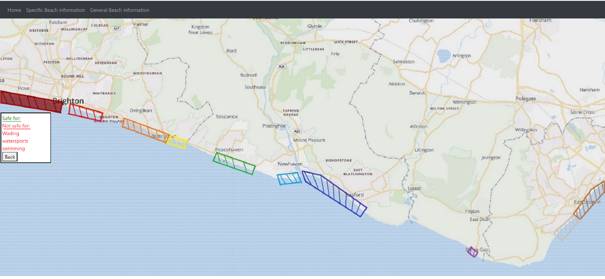

# SafeSwim
SafeSwim is a HTML and Python application, which tells swimmers whether an area of coastline is safe to swim in, using real time weather and tidal data.

## Features

- **Real Time Data**: Uses real time data from rest API's, to calculate whether the current conditions are safe to swim in.
- **Graphical User Interface**: Provides users with a simple interface, reducing confusion, resulting in a higgher likelyhood of them using the application again.
- **Provides Useful Information**: Provides users with information on being safe in open water.
- **Specific Beach Information**: Gives the user specific information on the various beaches in the region.

